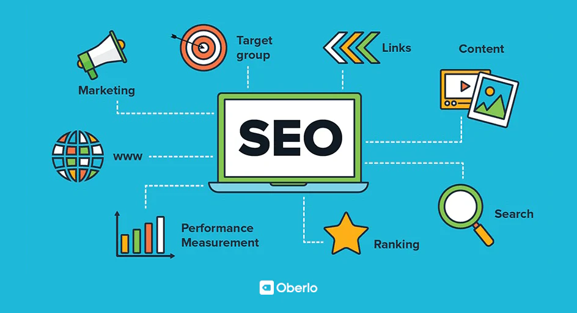

# Seocheck.my

SEO analyzer - user enters site URl and there are recommendations about meta tags, title, load times
etc

# PROD

https://seocheck.my

## Overview

Seocheck.pro is a web application designed to analyze websites for SEO best practices. Users can
input a URL, and the tool provides actionable recommendations regarding meta tags, page titles,
loading performance, technical SEO aspects, and content quality. It leverages multiple AI models to
enhance analysis and provide insightful suggestions.

## Key Features

- **Comprehensive SEO Analysis:** Checks for meta tags (title, description), headings, image alt
  text, robots.txt, sitemap presence, HTTPS status, mobile-friendliness, and more.
- **Performance Metrics:** Analyzes page load times and provides insights based on Core Web Vitals
  (future integration).
- **Content Evaluation:** Assesses content readability, keyword density, and provides AI-powered
  suggestions.
- **Multi-AI Integration:** Utilizes various AI models (Claude, DeepSeek, Gemini, Grok, OpenAI) for
  enhanced analysis and content generation tasks.
- **User Accounts:** Allows users to register, log in (`Login.jsx`, `SignUp.jsx`), manage their
  profile (`Profile.jsx`), and view historical analysis reports.
- **Feedback Mechanism:** Users can submit feedback through the `Feedback.jsx` component.
- **Admin Panel:** Interface (`Admin.jsx`) for user management and application monitoring.

## Project Architecture

- **Root Files:**

    - Configuration & deployment scripts: `.prettierrc`, `copy.cmd`, `deploy.cmd`, `kill.cmd`
    - Docker configurations: `Dockerfile`, `docker-compose.yml`
    - Core application files: `index.html`, `package.json`, `vite.config.js`, `rest.http`,
      `playground-1.mongodb.js`

- **Client (src/):** (React with Vite)

    - Main application entry and routing: `main.jsx`, `App.jsx`
    - Core layout components: `Navbar.jsx`, `BottomNavigationBar.jsx`
    - Pages: `Landing.jsx`, `Docs.jsx`, `Privacy.jsx`, `Terms.jsx`
    - User management: `Login.jsx`, `SignUp.jsx`, `Forgot.jsx`, `Reset.jsx`, `Profile.jsx`
    - Features: `Feedback.jsx`
    - Admin interface: `Admin.jsx`

- **Server (server/):** (Node.js/Express)

    - Entry point and core logic: `index.js`
    - Routing & Controllers: `admin.js`, `user.js`, `search.js`
    - AI Integrations: `claude.js`, `deepseek.js`, `gemini.js`, `grok.js`, `openai.js`
    - Middleware: `middleware/auth.js` (Authentication/Authorization)
    - Data Models (MongoDB/Mongoose): `models/Feedback.js`, `models/User.js` (Potentially requires a
      `Report.js` model)
    - Utilities: `utils.js`
    - Server-specific dependencies: `package.json`

- **Public (public/):**
    - Static assets: `ads.txt`, `landing.html`, `robots.txt`, `styles.css`, `image.png` (referenced
      in README)

This organized structure fosters clear separation of concerns (frontend, backend, static assets),
simplifies development and debugging, adheres to security best practices (e.g., auth middleware),
and supports independent scaling of client and server components using Docker.

## Design Ideas & Considerations

- **Refined UI/UX & Visualization:**

    - Develop a central `Dashboard.jsx` post-login displaying key summaries and recent reports.
    - Enhance report visualization: Use charts for scores/metrics, implement interactive elements
      allowing drill-down into specific issues with AI-powered explanations.
    - Formalize a component library based on existing elements (`Navbar.jsx`, etc.) or adopt a UI
      framework (e.g., Tailwind CSS, Material UI) for consistency and faster development, leveraging
      `styles.css`.
    - Prioritize Accessibility (a11y) by adhering to WCAG standards during design and development.
    - Ensure a seamless, responsive experience across devices.

- **Expanded Core SEO Analysis Engine:**

    - Integrate **Technical SEO Checks:** Validate `robots.txt` and `sitemap.xml`, check HTTPS
      implementation, analyze Schema markup (structured data), assess mobile-friendliness
      thoroughly, check for `hreflang` tags.
    - Add **Content Analysis Features:** Improve readability scores (e.g., Flesch-Kincaid), keyword
      density analysis, content length recommendations, duplicate content checks (within the site).
    - Incorporate **Performance Analysis:** Integrate Core Web Vitals (LCP, FID, CLS) using
      PageSpeed Insights API or libraries.
    - Implement **Link Analysis:** Basic internal linking checks (orphan pages, link depth) and
      explore external backlink analysis integrations.
    - Add **Image SEO Checks:** Verify alt text presence, suggest optimal image sizes, and recommend
      modern formats (WebP/AVIF).

- **Strategic Multi-AI Integration:**

    - Implement **Task-Specific AI Routing:** Automatically select the best AI model (`claude.js`,
      `deepseek.js`, etc.) for specific tasks (e.g., meta description generation vs. technical
      summary vs. content tone analysis) based on capability, cost, and context.
    - Develop **AI-Powered Suggestions:** Provide actionable, AI-generated recommendations for
      improving content, rewriting meta tags, or fixing technical issues directly within the
      reports.
    - Build an **AI Cost/Usage Management Layer:** Implement robust API key management (`server/`),
      caching for common AI requests, and monitoring/limits to control costs, potentially visible in
      `Admin.jsx`.

- **Improved User Workflow & Experience:**

    - Implement **Asynchronous Processing:** Use a robust job queue system (e.g., BullMQ, RabbitMQ)
      on the backend (`server/index.js`, `server/search.js`) for long-running SEO analyses,
      providing users with real-time progress indicators or notifications.
    - Enhance `Profile.jsx`: Store and display a history of analysis reports, potentially grouped by
      website/project.
    - Introduce **Project-Based Organization:** Allow users to group multiple URLs under named
      projects.
    - Enable **Scheduled Scans & Alerts:** Allow users to set up recurring scans for projects and
      receive notifications on completion or significant changes.
    - Add **Report Comparison:** Feature to compare two scan reports for the same URL over time.
    - Offer **Exportable Reports:** Allow users to download reports in formats like PDF or CSV.

- **Enhanced User Management & Security:**

    - Implement **Role-Based Access Control (RBAC):** Define roles (e.g., Free, Premium, Admin)
      using `middleware/auth.js` to control access to features and data limits.
    - Offer **Two-Factor Authentication (2FA):** Enhance account security for users.
    - Strengthen **Data Protection:** Ensure compliance with privacy regulations (`Privacy.jsx`,
      `Terms.jsx`) for user data (`models/User.js`) and analysis results. Apply security headers and
      input validation rigorously.
    - Implement **Rate Limiting:** Protect API endpoints (auth, search) against abuse.

- **Advanced Admin & Moderation Capabilities:**

    - Expand `Admin.jsx`: Include detailed user management, site-wide settings, feature flag
      controls, AI usage/cost dashboards, and system health monitoring (server load, DB status,
      queue length).
    - Manage User Feedback: Build tools within `Admin.jsx` to view, categorize, and respond to
      feedback submitted via `Feedback.jsx` (using `models/Feedback.js`).

- **Scalable & Optimized Backend Architecture:**

    - Leverage **Containerization (Docker):** Utilize `Dockerfile` and `docker-compose.yml` for
      consistent environments and easy scaling. Consider container orchestration (e.g., Kubernetes)
      for future growth.
    - Optimize **Database Performance:** Ensure appropriate indexing for MongoDB collections
      (`models/`) and optimize queries. Use connection pooling.
    - Refactor common logic into `server/utils.js` for reusability.
    - Consider **Microservices (Future):** If complexity increases, evaluate breaking the backend
      into smaller services (e.g., Auth, Analysis, AI Gateway).

- **Performance Optimization:**

    - **Client-Side:** Utilize Vite's features for bundling and code-splitting (`*.jsx` components).
      Optimize React rendering. Minify and compress static assets (`styles.css`, JS bundles). Use a
      CDN for `public/` assets.
    - **Server-Side:** Optimize API response times, especially for `search.js` and AI interactions.
      Implement server-side caching (e.g., Redis) where appropriate.

- **Resilient Error Handling & Centralized Logging:**

    - Implement comprehensive error handling on both client (`*.jsx`) and server (`server/`).
    - Establish **Structured, Centralized Logging:** Log errors and key events in a parseable format
      (e.g., JSON) from both client and server for monitoring (e.g., ELK, Datadog).
    - Implement **Distributed Tracing:** Track requests across services (client, server, AI APIs,
      job queue) to diagnose issues.

- **Continuous Integration/Delivery & Automated Testing:**

    - Set up **CI/CD Pipelines:** Automate testing, building (Vite), and deployment (using
      `deploy.cmd`, Docker) triggered by code commits (e.g., via GitHub Actions).
    - Develop **Comprehensive Automated Tests:** Include unit tests, integration tests (covering API
      endpoints, DB interactions, AI integrations), and end-to-end tests.
    - Enforce **Code Quality:** Integrate linting (ESLint) and formatting (`.prettierrc`) checks
      into the CI pipeline.
    - Implement a **Database Migration Strategy:** Manage schema changes (`models/`) reliably across
      deployments.

# TODO

- [ ] Implement API endpoints for user dashboard (`Dashboard.jsx`).
